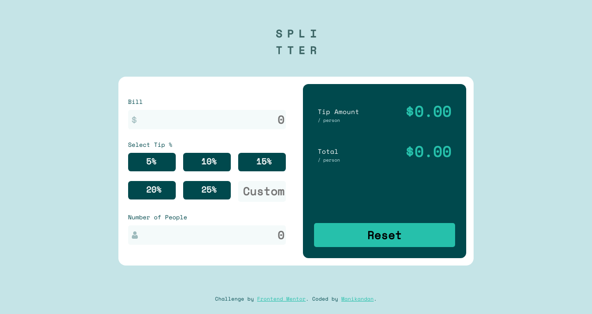

# Frontend Mentor - Tip calculator app solution

This is a solution to the [Tip calculator app challenge on Frontend Mentor](https://www.frontendmentor.io/challenges/tip-calculator-app-ugJNGbJUX). Frontend Mentor challenges help you improve your coding skills by building realistic projects.

## Table of contents

- [Overview](#overview)
  - [The challenge](#the-challenge)
  - [Screenshot](#screenshot)
  - [Links](#links)
- [My process](#my-process)
  - [Built with](#built-with)
  - [What I learned](#what-i-learned)
- [Author](#author)

## Overview

### The challenge

-To reproduce the ui of tip calculator with all of its function.

### Screenshot

### Links

- Solution URL: [Solution](https://www.frontendmentor.io/solutions/flexboxgrid-vanila-js-PpsQgrRY9#comment-6121376a497d89150337a2a8)
- Live Site URL: [Live demo](https://tip-calculator-fem.netlify.app/)

## My process

### Built with

- Semantic HTML5 markup
- Basic CSS 
- Flexbox
- CSS Grid
- Vanila JS

### What I learned

By doing this challange I have came to know how to do css for radio button and keep the label above the radio button and It was usefull for refreshing my basic css concepts.
And while doing vanila js I have refreshed some concepts like operators , conditional and some basic javascript concepts.

## Author

- Website - [Manikandan](https://manikandan.netlify.app/)
- Frontend Mentor - [@manismk](https://www.frontendmentor.io/profile/manismk)
- Twitter - [@_manismk](https://www.twitter.com/_manismk)

